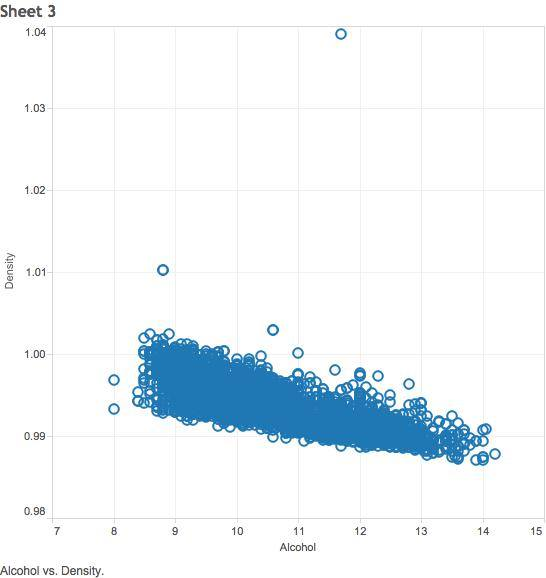
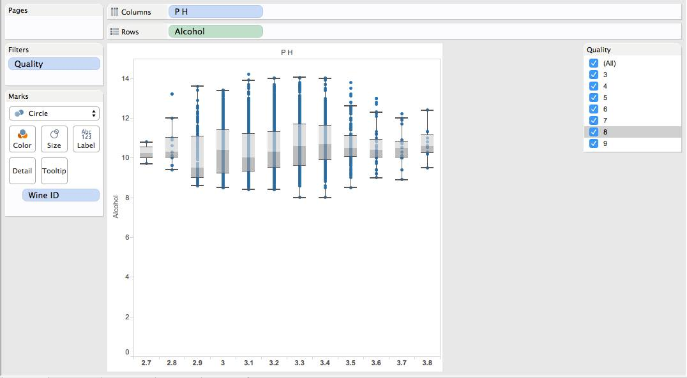
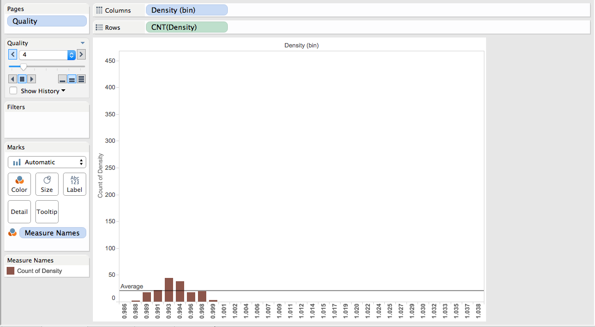
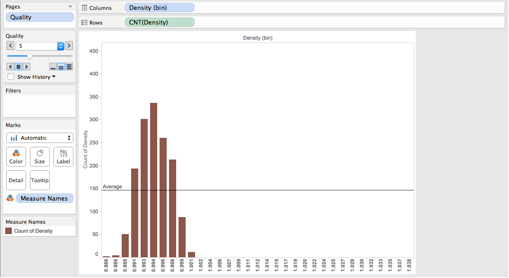
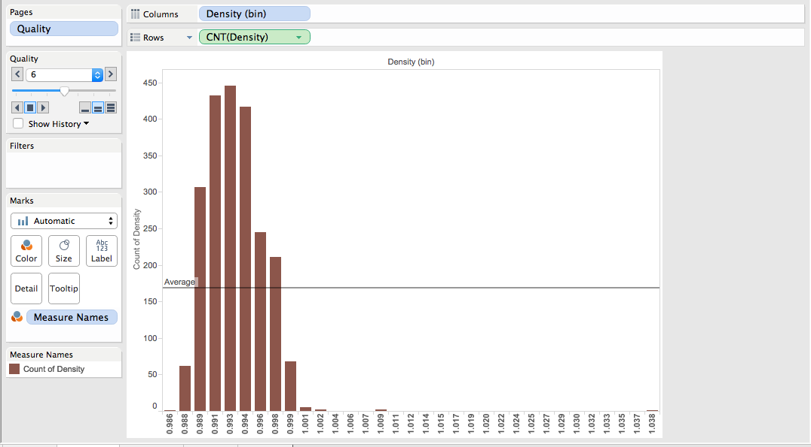
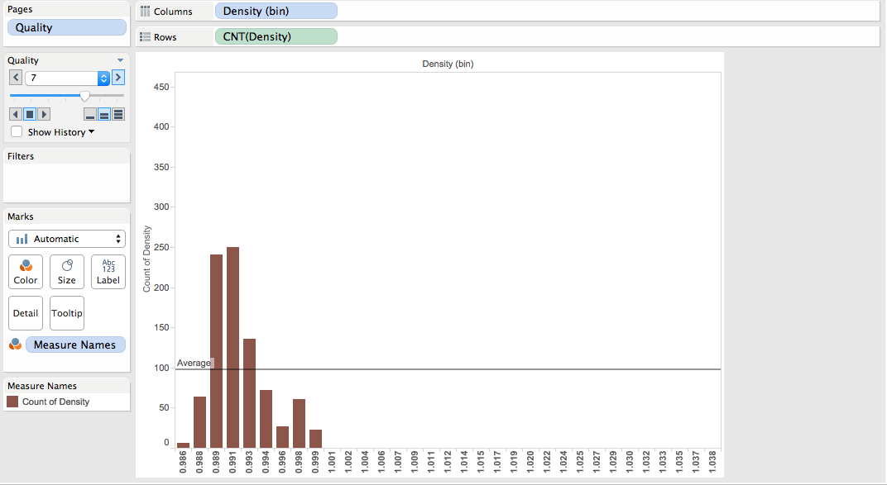
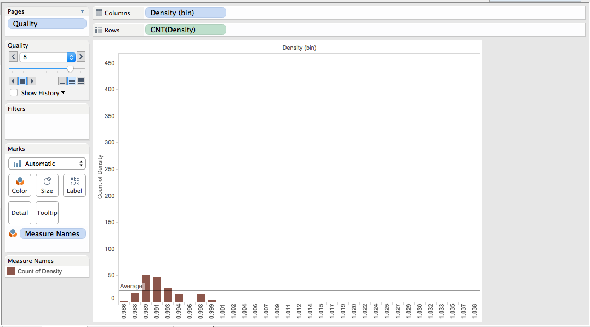
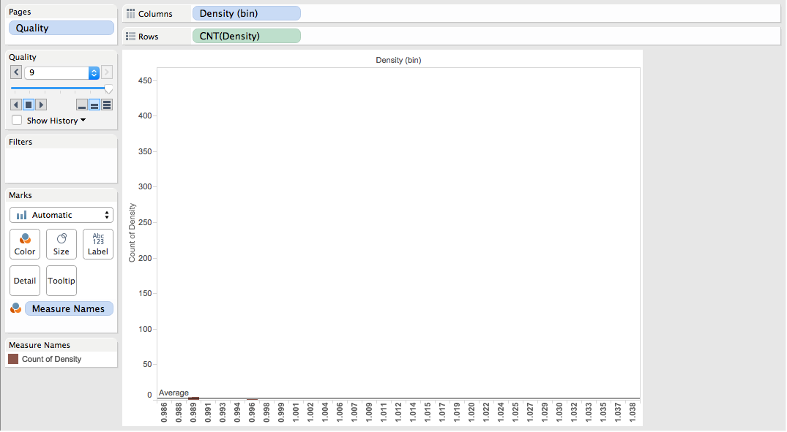
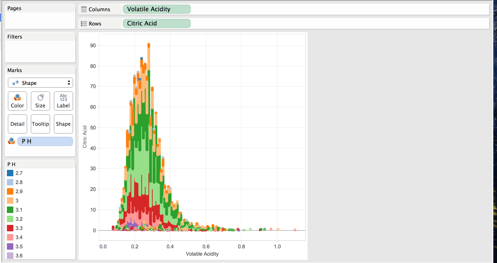
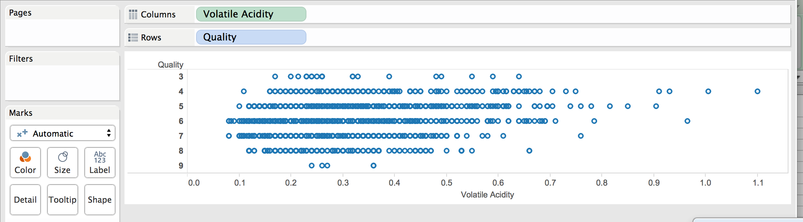

---
output:
  html_document:
    pandoc_args: [
      "+RTS", "-K64m",
      "-RTS"
    ]
---

## Steps

To reproduce Tableau's scatterplot, graph two continuous variables, specifically, the density of the white wine against its alcohol content. This shows an inverse relationship between alcohol content and white wine's density. The less alcohol content a wine had, the more dense it was. This could be due to other substances within the wine that's replacing the density of alcohol with a higher density.

To reproduce the bar graph of Tableau, graph two dimensional variables in rows and the average alcohol content in the column, specifically, the quality of the wine and the respective PH levels of the quality. This graph shows that generally, the better the quality of the wines, the more alcohol content that the wine contains. Also, the highest average alcohol content is concentrated around wine that have PH levels of 3.2 - 3.4. 

  

To reproduce the crosstab table of Tableau, graph one dimensional variable for both the rows and columns of Tableau, specifically quality in rows and pH levels in columns. The key performance indicator (KPI) that we analyzed was Citric Acid / Sugar levels. This can show how sour or sweet a particular white wine tastes. The numbers shown are the citric acid level, residual sugar level, and the KPI of a particular wine with specific PH and quality levels. The colors help show if a partciular wine with those characteristics have a high, low, or medium KPI. If the ratio is lower than 0.05, then the KPI is low, if the ratio is between 0.05 and 0.14, the KPI has a medium KPI ratio, and if it's higher than 0.14, then the KPI is high. A high KPI shows that a wine is more sour, a low kPI shows that a wine is more sweet, and a medium KPI shows a good balance between sweet and sour. 

As the visualization shows, if the PH moves higher from 3.2, the wine gernally has a good sweet to sour ratio. However, if the PH moves lower from 3.2 PH, the KPI becomes low, meaning that the wine tastes sweeter than other wines that have a higher PH. Also, as we move from the lower PH levels to higher PH levels, we see that the 

  

To reproduce the crosstab table in R, select variable names to the variables used in Tableau, such as pH, Quality, sum of Citric acid, sum of residual sugar, and KPI. The graph produced by R has to be zoomed to see the pH, Quality, sum of Citric Acid, and sum of residual sugar in text format.  

To reproduce the Bar chart in R, select variable names to the variables used in Tableau, such as quality, pH, and average alcohol content. 

To reproduce the scatterplot in R, select variable names to the variables used in Tableau, such as alcohol for the X axis and Density for the Y axis.

  
 

To reproduce the Boxplot in Tableau, start with the Alcohol measure and drag onto the rows of Tableau. Then add the PH dimension Columns. The wine will be filtered depending on its quality from 3-9. We wanted to see the variability of the alcohol content for a given PH level. We added the WineID to details so that we could refer back to the specific wine if there were any outliers. We added the filter of quality to see if that would make a difference but failed to produce any interesting results. As the PH levels increase from 2.7 to 3.4, the variability of the alcohol content increases, and as the PH level increases higher, the variability of the alcohol content decreases and the alcohol content becomes more concentrated.  

  
  
  
  
  
  

To reproduce the Histogram in Tableau, start with the Density Dimension and drag onto the columns of Tableau. This histogram will show the frequency of each density level given a specific wine quality. We wanted to see for a specific density level, how many times does that specific density level show up for a given wine quality.

You can see that the average quantity of wines at a given density level increases when going from the lower quality (4) to the higher quality (6) then declines as the quality increases from 7-9. This shows that the number of data that are of quality 6 is higher than any other quality of wines out there. 

Another interesting observation is that there isn't any skewness from quality 4-6, but as someone moves up qualities from 7-9, the data becomes positvely skewed. This shows that the higher the quality of a wine is, the less dense that wine is. 

  

To produce the above scatter plot, we start by dragging the Volatile Acidity measure to the Columns row, and the Citric Acid measure to the Rows row. PH is then dragged to the Colors box. 

It is interesting to note that the lower the Volatile Acidity, the higer is the Citric Acid content in the wine (which is counter intuitive!) 

Is it also interesting to note that the higher the Citric Acid content, the lower the Ph value. The lower the Citric Acid content, the higher the Ph value. This, as well, is counter intuitive. 

  

To produce the above barchart, we start with dragging the Volatile Acidity measure to the Columns row, and the Quality dimension to the Rows row.

An interesting observation from the above representation is that for wines of quality (which is determined based on the wine's smell, density, balance and depth) 5, 6 and 7, there is a higher concentration of samples in the lower volatile acidity range. That goes to say that a greater number of wines with quality 5, 6, and 7 and low volatile acidity exist, as compared to wines with other qualities. Wines of other qualities tend to have a more evenly distributed representation on the volatile acidity scale. 

Shiny link:

https://shs855.shinyapps.io/Shiny_DVS_Project1

